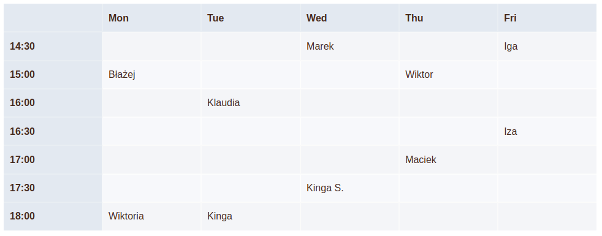

# Schedule creator. Tutor's assist tool
Some tutors have to set up an individual schedule for their students. This is especially the case with nonprofessional teachers helping others with a specific subject, be it mathematics or a foreign language. At times it's a difficult task to create a good schedule, that's optimal for all the students, given that some of them have only specific days available in a week and few free time slots in those days. This project is a tool pulling the accessibility of one's students and creating a schedule that suits all of them.

